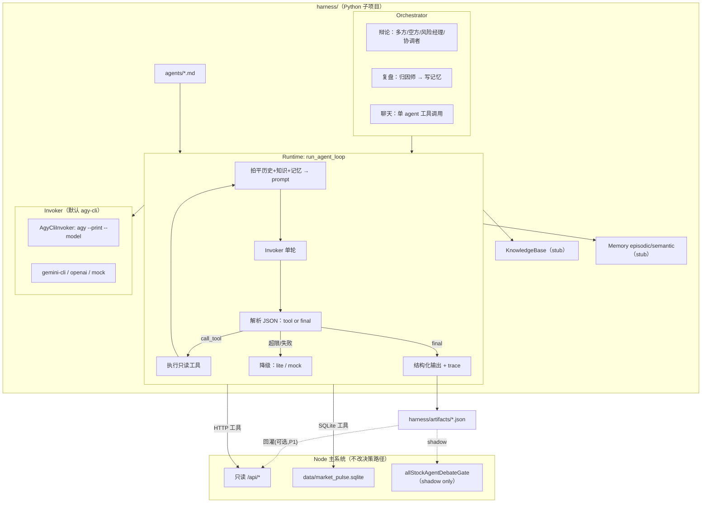

# Market Pulse AI —— Agent Harness 架构设计（Python 版）

> 日期：2026-07-01（v2：技术栈从"内嵌 Node"改为"独立 Python 子项目"，指定 agy-cli 为 LLM invoker，补知识库/记忆模块与 agent md 规范）
> 定位：为项目补齐一个**独立的 Python Agent 运行时（harness）**，与现有 Node 主系统**同仓库、跨语言协作**，让"不同 agent 真正 run 起来"——即真正的 `模型输出 → 工具调用 → 结果回喂 → 再调模型` 循环。
> LLM invoker：**默认且主力使用 `agy-cli`（Antigravity CLI）**，这是本 harness 与主流 harness（多依赖 OpenAI/Anthropic 原生 function calling）最大的不同，架构必须围绕它设计。
> 衔接文档：[`STOCK_RECOMMENDER_EVOLUTION_DESIGN.md`](STOCK_RECOMMENDER_EVOLUTION_DESIGN.md)（因子主线、§6.4 复盘、§11 红线）、[`IMPROVEMENT_PLAN_V3.md`](IMPROVEMENT_PLAN_V3.md)（V3-5 工具聊天、V3-11 多轮辩论、V3-2 debate 门控）。
> Scope：harness **只驱动"投研 / 解释 / 辩论 / 复盘 / 聊天"层**，最终买卖分仍由现有 `factor snapshot + rule + 风险门控` 决定（对齐 §1「LLM 不直接决定买卖」红线）。
> 重要声明：本文用于系统设计，不构成个性化投资建议。

---

## 0. 为什么写这份文档（问题陈述）

代码通读后的事实：**当前项目没有真正的 Agent Harness。** 所谓"不同 agent"，运行时并没有各自独立、由 LLM 驱动、能调工具、能多轮推进的执行体：

| 类别 | 代表 | 真实运行状态 |
|---|---|---|
| 规则引擎（真跑，但非 LLM agent） | `runAllStockAgentForRun` / `buildAllStockAgentEvaluation`（`server.mjs`） | ✅ 完整闭环，但**确定性 JS 规则**，不调 LLM |
| "多智能体辩论"（伪 agent） | `buildAgentDebate`（`server.mjs`） | ❌ 6 角色全是 **if-else 打分**，`trading-agents-lite-v1`，不 run |
| 单次 LLM 调用（非 agent loop） | `/api/chat`、投资建议、narrative、日报 | ⚠️ 全是 `callConfiguredLlm(system, user)` **一次进出**，无工具、无多轮 |

V3 里已散落多个 agentic 需求（`V3-5` 工具聊天、`V3-11` 多轮辩论、§6.4 Swarm 复盘 / Persistent Memory），但它们都缺同一个**统一 runtime 地基**。本文档补这块地基——**这一版用独立 Python 子项目实现**。

---

## 1. 目标与非目标

### 1.1 目标

1. **独立 Python harness，同仓库**：新增 `harness/` Python 子项目，与 Node 主系统解耦但共处一个 repo、共享 `data/`。
2. **Agent Runtime**：`run_agent_loop(agent_spec, input)`，实现 `LLM → 工具 → 回喂 → 再 LLM → … → 终止` 多轮循环。
3. **agy-cli 为默认 LLM invoker**：围绕子进程纯文本 CLI 设计，不依赖原生 function calling；可降级到其它 provider 或 mock。
4. **Tool 层**：把现有只读能力包装成工具——① 调 Node 只读 HTTP API；② 直接读 `data/market_pulse.sqlite`。
5. **典型模块预留（短期可 stub）**：知识库（KnowledgeBase）、记忆（Memory：episodic + semantic），先定义接口与最小实现，后续再上向量化。
6. **agent 用 md 定义**：每个 agent 一个 markdown 文件（frontmatter 元数据 + System Prompt 正文 + Changelog），沿用 `all_stock_agent_skill.md` 的"人读 + 机读 + changelog"风格。
7. **零回归降级 + 全程 trace**：任何失败回退现有 lite 结果，不影响 Node 主流程；每步落 trace。

### 1.2 非目标（红线）

- **不让 LLM 输出最终买卖分**（`STOCK_RECOMMENDER_EVOLUTION_DESIGN.md` §11）。harness 产物只作为 **shadow 门控**（对齐 `allStockAgentDebateGate`），不改 `actionScore`。
- **不改写 Node 决策路径。** Python harness 是**旁路增强**：产物落文件/回灌端点，Node 侧照旧。
- **不做写操作工具。** 所有工具**只读**（读 API / 读 SQLite 镜像）。不暴露下单、改 skill、改 store 的工具。
- **不依赖 provider 原生 tool calling。** 见 §3.1，统一走文本 JSON 协议以兼容 agy-cli。
- **不引入重型 agent 框架**（LangGraph / autogen 等）。用 Python 标准库 + 极少依赖手写。

### 1.3 Scope（本轮）

harness 只驱动"投研 / 解释"层，落点为三个已有规划项，全部复用同一 runtime：
- **V3-11**：`buildAgentDebate` 从 if-else 升级为**真·多轮 LLM 辩论**（低频 / 高优标的才跑）。
- **V3-5**：`/api/chat` 升级为**工具调用聊天**。
- **§6.4**（后续）：交易结束后的 **Swarm 复盘归因**，写入记忆库。

---

## 2. 术语

| 术语 | 含义 |
|---|---|
| **Invoker** | LLM 调用抽象。默认实现 `AgyCliInvoker`（子进程调 `agy`）。 |
| **Tool** | 只读函数 + JSON schema，agent 可请求调用。分 HTTP 工具与 SQLite 工具。 |
| **Agent** | 一个 md 文件：frontmatter（元数据）+ System Prompt + Changelog。 |
| **Runtime / Harness** | `run_agent_loop`：驱动单个 agent 多轮跑到终止。 |
| **Orchestrator** | 编排多 agent（辩论/复盘）并汇总。 |
| **KnowledgeBase** | 静态领域知识（研究方法、行业图谱、术语），供 agent 检索注入。 |
| **Memory** | 运行中/跨会话记忆：episodic（单次复盘教训）+ semantic（长期投资信念）。 |
| **Tool JSON 协议** | provider 无关约定：LLM 用一段 JSON 表达"调工具"或"最终答案"。 |
| **Trace** | 一次 agent 运行的完整步骤记录。 |

---

## 3. 关键约束（决定架构）

### 3.1 agy-cli 作为 LLM invoker（核心约束）

现有 Node 侧 `callAntigravityCli`（`server.mjs`）已经跑通 agy-cli，harness 复刻其行为：

| 项 | 值（默认，可配置） | 来源 |
|---|---|---|
| 命令 | `agy`（`ANTIGRAVITY_CLI_COMMAND`） | `server.mjs` 常量 |
| 参数模板 | `["--print", "{prompt}", "--model", "{model}"]`（`ANTIGRAVITY_CLI_ARGS_JSON`） | 同上 |
| prompt 组装 | `{prompt} = f"{system}\n\n{user}"` | `antigravityCliArgs` |
| 传输 | 子进程 stdout（`stdin` 关闭，prompt 走命令行参数） | `callAntigravityCli` |
| 输出解析 | 先 `json.loads(stdout)` 取 `response` / `text` / `output`；失败回退 `stdout.strip()` | 同上 |
| 模型分档 | light / standard / reasoning / heavy（默认同一模型，可分别配） | `antigravityCliModelForTask` |
| 超时分档 | light 180s / standard 300s / reasoning 600s / heavy 600s | `antigravityCliTimeoutForTask` |
| 失败处理 | 非 0 退出码取 stderr；超时 kill 进程树 | 同上 |

**决定性结论**：agy-cli 是**子进程纯文本、无结构化 function calling、单轮延迟高（分钟级）**。因此 harness：
1. **工具调用必须走文本 JSON 协议（ReAct 风格）**：让模型在正文里输出约定 JSON，harness 解析后执行工具、把结果拼进下一轮 prompt 回喂。这与 provider 是否支持原生 tools 无关，agy-cli 也能用。
2. **多轮历史拍平进单个 prompt**：agy-cli 没有 messages 数组，harness 把 `[system] + [历史轮次 + 工具结果]` 序列化成一个大 prompt，每轮重新调 `agy`。
3. **步数/工具数要克制**：单轮分钟级延迟 → `max_steps` 设小（3–5），高优标的才跑。
4. **降级链**：`agy-cli`（默认）→ 可配 `gemini-cli` / `gemini-api` / `openai` → `mock`（离线测试）→ 失败回退 Node lite 结果。

### 3.2 决策红线

买卖分由 `buildAllStockAgentEvaluation`（`ruleScore` 正式 + `actionScore` shadow）决定。harness 辩论/复盘产物**只能经 `allStockAgentDebateGate` 做 shadow 降权**（该 gate 只读 `finalDecision.action` / `riskVeto`，见 §6.2 兼容性）。

### 3.3 与 Node 主系统的关系（跨语言）

Python harness **不重新实现采集**，通过两条只读通道取数据：
- **HTTP**：调 Node `/api/*` 只读端点（数据新鲜、复用全部采集逻辑）。调用时传 `llmProvider="local"`，避免触发 Node 端二次 LLM、控制成本。
- **SQLite**：直接只读 `data/market_pulse.sqlite`（历史决策/outcome/factor_stats/runs，Python 原生 `sqlite3`，零依赖、零耦合）。

---

## 4. 目标架构

### 4.1 目录结构（同仓库 Python 子项目）

```text
market-pulse-ai/
├─ server.mjs                 # 现有 Node 主系统（不改动其决策路径）
├─ data/                      # 共享数据（Node 写，Python 只读）
│  ├─ store.json
│  └─ market_pulse.sqlite     # SQLite 镜像（sqlite_store_sync.py 生成）
├─ strategies/
│  └─ all_stock_agent_skill.md
└─ harness/                   # ★ 新增：独立 Python 子项目
   ├─ README.md
   ├─ pyproject.toml          # 依赖：标准库为主，可选 pyyaml/requests
   ├─ config.py               # 端点、SQLite 路径、agy 命令、模型/超时档
   ├─ cli.py                  # 入口：python -m harness debate|chat|review ...
   ├─ invoker/
   │  ├─ base.py              # LlmInvoker 抽象 + 结果/异常类型
   │  ├─ agy_cli.py           # ★ 默认：复刻 callAntigravityCli
   │  ├─ gemini_cli.py        # 备选
   │  ├─ openai_api.py        # 备选
   │  └─ mock.py              # 离线测试
   ├─ runtime/
   │  ├─ loop.py              # run_agent_loop（文本 JSON 协议循环）
   │  ├─ protocol.py          # 解析工具调用 / final JSON（容错）
   │  ├─ budget.py            # step / tool / 时间预算
   │  └─ trace.py             # AgentTrace 记录
   ├─ tools/
   │  ├─ registry.py          # ToolRegistry + schema 校验
   │  ├─ http_tools.py        # 调 Node 只读 API
   │  └─ sqlite_tools.py      # 读 data/market_pulse.sqlite
   ├─ agents/                 # ★ agent 定义（md）
   │  ├─ loader.py            # 解析 frontmatter + System Prompt
   │  ├─ bull_researcher.md
   │  ├─ bear_researcher.md
   │  ├─ risk_manager.md
   │  ├─ coordinator.md
   │  ├─ chat_analyst.md
   │  └─ review_attributor.md
   ├─ orchestrator/
   │  ├─ debate.py            # 多空辩论 → 兼容 v1 输出
   │  └─ review.py            # 交易复盘归因
   ├─ knowledge/              # 知识库（短期 stub）
   │  ├─ base.py              # KnowledgeBase 接口
   │  └─ files/               # md 知识条目（研究方法/行业图谱/术语）
   ├─ memory/                 # 记忆（短期 stub）
   │  ├─ base.py              # Memory 接口（episodic + semantic）
   │  └─ sqlite_memory.py     # 最小实现：data/agent_memory.sqlite
   └─ artifacts/              # harness 产物（辩论纪要/trace，Node 可回读）
```

### 4.2 分层图



### 4.3 LLM Invoker 层

抽象接口（`invoker/base.py`）：

```python
@dataclass
class LlmResult:
    text: str
    provider: str          # e.g. "agy-cli:gemini-flash-lite:reasoning"
    raw: str | None = None

class LlmInvoker(Protocol):
    def invoke(self, system: str, user: str, *, tier: str = "standard",
               timeout_ms: int | None = None) -> LlmResult: ...
```

默认实现（`invoker/agy_cli.py`，复刻 `callAntigravityCli`）：

```python
class AgyCliInvoker:
    def __init__(self, command="agy", args_template=None, models=None, timeouts=None):
        self.command = os.environ.get("ANTIGRAVITY_CLI_COMMAND", command)
        self.args_template = args_template or ["--print", "{prompt}", "--model", "{model}"]
        self.models = models or {"light": "...", "standard": "...", "reasoning": "...", "heavy": "..."}
        self.timeouts = timeouts or {"light": 180, "standard": 300, "reasoning": 600, "heavy": 600}

    def invoke(self, system, user, *, tier="standard", timeout_ms=None):
        model = self.models.get(tier, self.models["standard"])
        prompt = f"{system}\n\n{user}"
        args = [a.replace("{prompt}", prompt).replace("{model}", model) for a in self.args_template]
        proc = subprocess.run([self.command, *args], capture_output=True, text=True,
                              cwd=tempfile.gettempdir(),
                              env={**os.environ, "NO_COLOR": "1"},
                              timeout=(timeout_ms or self.timeouts[tier] * 1000) / 1000)
        if proc.returncode != 0:
            raise InvokerError(proc.stderr.strip() or f"agy exited {proc.returncode}")
        text = _parse_agy_stdout(proc.stdout)   # 先 json(response/text/output)，再回退 strip()
        if not text:
            raise InvokerError(proc.stderr.strip() or "agy returned no text")
        return LlmResult(text=text, provider=f"agy-cli:{model}:{tier}", raw=proc.stdout)
```

**降级链**（`invoker` 组合）：`agy-cli` → 备选 provider → `mock`。带**失败冷却**（复刻 Node 的 cooldown 思想，避免连环超时）与**有限重试**。

### 4.4 Tool 层

工具全**只读**，两类：

**A. HTTP 工具（调 Node 只读 API，传 `llmProvider=local`）**

| tool | 端点 | 入参 | 返回要点 |
|---|---|---|---|
| `get_stock_snapshot` | `POST /api/stocks/snapshot` | `{ticker}` | quote/technical/fundamental/options/socialHot |
| `get_research_pack` | `GET /api/research-pack` | `{ticker}` | 一致预期/EPS 修正/目标价/反向 DCF |
| `get_industry_chain` | `GET /api/industry-chain-pack` | `{ticker}` | 同业/上下游 |
| `get_news_catalyst` | `GET /api/news/all` | `{ticker}` | 新闻正文摘要/催化方向 |
| `get_options_chain` | `POST /api/options/chain` | `{ticker}` | IV 分位/大单 |
| `get_macro_regime` | `GET /api/fred/macro-regime` | `{}` | 大盘 regime/风险分 |
| `get_investment_advice` | `GET /api/investment-advice` | `{ticker}` | 现有投资建议 + evidence |

**B. SQLite 工具（只读 `data/market_pulse.sqlite`，标准库 sqlite3）**

| tool | 表 | 用途 |
|---|---|---|
| `get_recent_decisions` | `recommendation_decisions` | 该票历史买卖建议 |
| `get_decision_outcomes` | `recommendation_outcomes` | T+N 追责 / 超额 / MAE-MFE |
| `get_factor_stats` | `factor_stats` | 因子 rankIC / 命中率 |
| `get_run_snapshot` | `runs`(full_json) | 某次采集的完整 run |

工具定义（`tools/registry.py`）：

```python
@dataclass
class Tool:
    name: str
    description: str
    parameters: dict          # JSON schema
    handler: Callable
    read_only: bool = True
    max_calls_per_run: int = 3
    timeout_ms: int = 15000
```

### 4.5 Agent Runtime：`run_agent_loop`

```python
def run_agent_loop(spec: AgentSpec, task_input: dict, ctx: RunContext) -> AgentResult:
    kb_context = ctx.knowledge.retrieve(spec, task_input)      # 知识注入（stub 可空）
    mem_context = ctx.memory.recall(spec, task_input)          # 记忆注入（stub 可空）
    history = [render_input(task_input, kb_context, mem_context)]
    trace, budget = AgentTrace(spec.id), Budget(spec)

    for step in range(spec.max_steps):
        system = spec.system_prompt + "\n\n" + tool_protocol(spec.tools)
        try:
            turn = ctx.invoker.invoke(system, render_history(history),
                                      tier=spec.tier, timeout_ms=spec.timeout_ms)
        except InvokerError as e:
            return fallback_result(spec, task_input, trace, f"invoker_error:{e}")

        parsed = parse_protocol(turn.text)     # 容错解析
        trace.add(step, turn, parsed)

        if parsed is None or parsed.get("action") == "final":
            return AgentResult(output=coerce_output(spec, parsed, turn.text), trace=trace)

        if parsed.get("action") == "call_tool":
            if budget.tool_exhausted() or parsed["tool"] not in spec.tool_names:
                history.append(tool_msg(parsed.get("tool"), "工具不可用/超上限，请基于现有信息 final。"))
                continue
            budget.count_tool()
            result = ctx.tools.call(parsed["tool"], parsed.get("args", {}))  # 异常内部转 {error}
            history.append(assistant_msg(turn.text))
            history.append(tool_msg(parsed["tool"], clip(result, 6000)))
            continue

        history.append(user_msg("请严格输出约定 JSON：call_tool 或 final。"))

    return fallback_result(spec, task_input, trace, "max_steps_reached")
```

要点：`max_steps`/`max_tool_calls`/累计时长三重预算；任何异常 → `fallback_result`（返回 Node lite 结果或 mock）；知识/记忆注入是可选 hook，stub 阶段返回空。

### 4.6 Agent 定义与加载（md 规范）

每个 agent 一个 md：**YAML frontmatter（机读元数据）+ `## System Prompt`（注入 LLM 的正文）+ `## 角色说明` + `## Changelog`**。见 §8 与 `harness/agents/*.md`。

加载器（`agents/loader.py`）：解析 frontmatter → `AgentSpec`，抽取 `## System Prompt` 段正文作为 `system_prompt`。frontmatter 字段：

```yaml
id: bull_researcher
name: 多方研究员
tier: reasoning              # 映射 invoker 模型档
tools: [get_stock_snapshot, get_research_pack, get_news_catalyst, get_factor_stats]
max_steps: 4
max_tool_calls: 4
timeout_ms: 45000
output_schema: debate-argument-v1
veto_power: false            # 仅 risk_manager 为 true（且只影响 shadow）
```

### 4.7 Orchestrator

**辩论（`orchestrator/debate.py`，替换 `buildAgentDebate` if-else）**：

```python
def run_debate(ticker, ctx):
    bull = run_agent_loop(load("bull_researcher"), {"ticker": ticker}, ctx)
    bear = run_agent_loop(load("bear_researcher"), {"ticker": ticker}, ctx)
    # 可选反驳轮（低频标的才开）：把对方论点作为输入再各跑 1 轮
    risk = run_agent_loop(load("risk_manager"),
                          {"ticker": ticker, "bull": bull.output, "bear": bear.output}, ctx)
    final = run_agent_loop(load("coordinator"),
                           {"ticker": ticker, "bull": bull.output, "bear": bear.output, "risk": risk.output}, ctx)
    return to_debate_payload_v2(ticker, bull, bear, risk, final)  # 兼容 v1（见 §6.2）
```

**复盘（`orchestrator/review.py`，§6.4）**：交易结束触发，归因师读 decision+outcome+factor_stats，产出复盘文本并写入 `Memory`（episodic 教训）。

### 4.8 知识库模块（KnowledgeBase，短期 stub）

用途：给 agent 注入稳定领域知识（研究方法、行业供应链图谱、术语口径、"不做的事"清单），减少幻觉、统一口径。

```python
class KnowledgeBase(Protocol):
    def retrieve(self, spec: AgentSpec, task_input: dict, k: int = 3) -> list[KnowledgeChunk]: ...
```

- **短期实现（stub）**：读 `harness/knowledge/files/*.md`，按标题/关键词简单匹配（或全量小文件直接注入）。
- **未来**：切换到向量检索（embedding + 相似度），接口不变。

### 4.9 记忆模块（Memory，短期 stub）

两类记忆（对齐 `STOCK_RECOMMENDER_EVOLUTION_DESIGN.md` §6.4 Persistent Memory）：
- **episodic**：单笔交易复盘教训（"降息初期不要因短期利好过早买高息股"），带 ticker/日期/regime/结果标签。
- **semantic**：跨 episode 沉淀的长期投资信念/规律。

```python
class Memory(Protocol):
    def recall(self, spec, task_input, k: int = 5) -> list[MemoryItem]: ...   # 召回相关记忆注入 prompt
    def write_episodic(self, item: MemoryItem) -> None: ...                   # 复盘后写入
    def promote_to_semantic(self, items: list[MemoryItem]) -> None: ...       # 多 episode → 信念
```

- **短期实现（stub）**：`memory/sqlite_memory.py` 用**独立库 `data/agent_memory.sqlite`**（已定：与 `market_pulse.sqlite` 分离，不参与 `sqlite_store_sync.py` 镜像同步，避免污染），`recall` 走关键词/ticker/regime 过滤 + 时间倒序。
- **未来**：向量召回 + 信念聚合。接口不变。
- **红线**：记忆只影响"解释/辩论/复盘"上下文，**不自动调 skill 权重、不改买卖分**。

### 4.10 Trace 与可观测

每次运行落 `AgentTrace`（§6.1）到 `harness/artifacts/` + 日志，供：UI 展开推理轨迹、复盘归因、成本审计（token/时长/工具数）。

---

## 5. 工具调用协议（provider 无关文本 JSON）

模型每轮**只输出一个 JSON 对象**。

工具调用：
```json
{ "action": "call_tool", "thought": "需要 NVDA 一致预期", "tool": "get_research_pack", "args": { "ticker": "NVDA" } }
```

最终答案：
```json
{ "action": "final", "stance": "看多", "confidence": 72, "argument": "…", "evidence": ["…"], "risks": ["…"] }
```

**终止**：`action=="final"`；或达 `max_steps`/`max_tool_calls`/时间预算；或连续 2 次协议不符；或 invoker 失败。后三者 → 降级。

**降级矩阵（零回归）**：

| 情况 | 行为 |
|---|---|
| 无可用 invoker / agy 不在 PATH | 返回 Node lite 结果（或 mock） |
| invoker 超时/异常/连环失败（冷却） | 返回 lite + trace 标注原因 |
| 工具异常 | 该工具返回 `{error}`，agent 继续或收敛 |
| 超预算 | 用已有信息强制 final；不足则 lite |
| 解析失败 | 提示纠正一次，仍失败则 lite |

---

## 6. 数据契约

### 6.1 AgentTrace

```json
{
  "schemaVersion": "agent-trace-v1",
  "agent": "bull_researcher",
  "ticker": "NVDA",
  "invoker": "agy-cli:gemini-flash-lite:reasoning",
  "steps": [
    { "step": 0, "kind": "tool_call", "tool": "get_research_pack", "args": {"ticker": "NVDA"} },
    { "step": 0, "kind": "tool_result", "tool": "get_research_pack", "ok": true, "bytes": 2841 },
    { "step": 1, "kind": "final", "summary": "看多，信心 72" }
  ],
  "budget": { "steps": 2, "toolCalls": 1, "ms": 48210 },
  "degraded": false, "degradeReason": ""
}
```

### 6.2 辩论输出（兼容现有消费方）

Orchestrator 产物**必须向后兼容** `trading-agents-lite-v1`。`allStockAgentDebateGate`（`server.mjs`）只读 `finalDecision.action` / `riskVeto`，保留即可无缝切换、**买卖门控行为不变**：

```json
{
  "schemaVersion": "trading-agents-llm-v2",
  "framework": "Python harness 多轮 LLM 辩论（agy-cli），工具取证",
  "ticker": "NVDA",
  "agents": [ /* 兼容 v1：role/name/stance/confidence/view/evidence */ ],
  "debateRounds": [ /* 兼容 v1：title/speaker/stance/argument */ ],
  "finalDecision": { "action": "…", "riskVeto": false, "confidence": 68, "rationale": ["…"] },
  "traces": [ /* agent-trace-v1[]，v2 新增，v1 消费方忽略 */ ]
}
```

### 6.3 记忆记录（memory-item-v1）

```json
{
  "schemaVersion": "memory-item-v1",
  "kind": "episodic",
  "ticker": "NVDA",
  "asOf": "2026-07-01",
  "regime": "risk-on",
  "lesson": "财报前 IV 高企时追多，财报后 IV crush 吃掉方向收益。",
  "sourceDecisionId": "rec-buy-20260701-NVDA",
  "outcome": "fail",
  "tags": ["earnings", "iv-crush"]
}
```

---

## 7. 与现有 Node 系统的集成（数据桥 + 产物回灌 + 调度）

| 方向 | 机制 | 说明 |
|---|---|---|
| **取数据（读）** | Node 只读 `/api/*` + 只读 `data/market_pulse.sqlite` | Python 不重实现采集；HTTP 传 `llmProvider=local` |
| **产物落地** | 写 `harness/artifacts/{date}/{ticker}.debate.json` + trace | P0 只落文件，离线可看 |
| **回灌（P1，已定）** | 新增 Node 端点 `POST /api/agent-debate/ingest` | Python 主动把 v2 辩论写回对应 run 的 `narrative.agentDebate`；下游 `allStockAgentDebateGate` 照旧 shadow |
| **调度（已定：Node spawn）** | P0：CLI 手动/脚本；P1 起：Node 定时任务 `spawn python -m harness ...`（模式同 `sqlite_store_sync.py`，复用现有 schedule） | 高优标的白名单 + 频率控制；暂不用独立 cron |

集成原则：**旁路增强、可灰度、可回滚**。Node 主流程在 harness 未运行/失败时行为完全不变。

---

## 8. Agent 清单与 md 设计

### 8.1 md 规范

```markdown
---
id: <机器名>
name: <中文名>
tier: light|standard|reasoning|heavy
tools: [<tool 名>...]
max_steps: <int>
max_tool_calls: <int>
timeout_ms: <int>
output_schema: <schema 名>
veto_power: <bool>
---

# <name>

## 角色说明        # 人类可读：职责、边界、原则
## System Prompt   # 机器读：实际注入 LLM 的系统提示（含协议约束、红线）
## Changelog       # 版本记录
```

加载器读 frontmatter 得 `AgentSpec`，抽 `## System Prompt` 段作为系统提示。

### 8.2 本轮 agent 清单（已随本设计创建于 `harness/agents/`）

| agent | 文件 | tier | 作用 | veto |
|---|---|---|---|---|
| 多方研究员 | `bull_researcher.md` | reasoning | 取证论多 | 否 |
| 空方研究员 | `bear_researcher.md` | reasoning | 取证论空 | 否 |
| 风险经理 | `risk_manager.md` | reasoning | 审读双方 + 硬门控证据，给 shadow veto | 是(仅 shadow) |
| 协调者 | `coordinator.md` | standard | 汇总为兼容 v1 的 finalDecision | 否 |
| 复盘归因师 | `review_attributor.md` | reasoning | 交易结束归因 + 写记忆 | 否 |
| 聊天分析师 | `chat_analyst.md` | standard | 工具调用聊天（V3-5） | 否 |

---

## 9. 落地阶段

### P0 —— 最小可用 harness（先跑通"一个 agent 真的 run"）
- `harness/` 骨架 + `AgyCliInvoker` + `mock` + `run_agent_loop`（文本 JSON 协议）+ 3 个只读工具（`get_stock_snapshot` / `get_research_pack` / `get_factor_stats`）。
- 1 个真 agent（先用 `chat_analyst` 或临时 `single_analyst`）对单只标的跑工具循环，产 trace 到 `artifacts/`。
- 预算/降级/trace 到位；知识库/记忆先空实现（接口在、返回空）。
- **验收**：`python -m harness run --agent chat_analyst --ticker NVDA` 能看到"调工具→拿数据→再推理→final"多轮 trace；`agy` 不可用时自动降级不报错。

### P1 —— 多 agent 辩论 orchestrator（V3-11）
- 4 个辩论 agent（bull/bear/risk/coordinator）+ `run_debate` + 输出 `trading-agents-llm-v2`（兼容 v1）。
- 回灌端点 `POST /api/agent-debate/ingest`（已定）+ Node 定时 spawn；高优标的白名单 + `DEBATE_LLM_ENABLED`。
- **验收**：候选票辩论纪要来自真实多轮 agy-cli + 工具取证；`allStockAgentDebateGate` 不改仍正常 shadow。

### P2 —— 聊天 + 复盘 + 记忆落地
- V3-5：Node `/api/chat` 在 `activeLlmProvider` 时委托 harness（spawn 或内部 HTTP），失败回退现有单次调用。
- §6.4：`review_attributor` + `run_review`，交易结束写 episodic 记忆。
- 知识库/记忆从 stub 升级为可检索（关键词 → 后续向量）。

---

## 10. 依赖与运行

- **Python**：3.10+（与现有 `scripts/*.py` 一致，标准库为主）。
- **依赖**：`sqlite3`（内置）；HTTP 用 `urllib`（零依赖）或 `requests`（可选）；frontmatter 用极简自解析或可选 `pyyaml`。全部列入 `harness/pyproject.toml`，保持轻量。
- **配置**：`harness/config.py` 读环境变量（`ANTIGRAVITY_CLI_COMMAND`、`MARKET_PULSE_BASE_URL`、`SQLITE_DB_FILE` 等），默认对齐 Node `.env`。
- **入口**：`python -m harness <debate|chat|review|run> [--ticker ...] [--invoker agy-cli|mock]`。

---

## 11. 可观测 / 成本 / 安全

- **成本**：agy-cli 单轮分钟级 → `max_steps` 小、只对高优标的开辩论、同 run 内缓存工具结果、trace 记 token/时长/工具数。
- **超时/失败**：invoker 分档超时 + 进程树 kill + 失败冷却 + 有限重试（复刻 Node 行为）。
- **安全**：工具全只读；无 shell/文件写/下单工具；`args` 过 JSON schema + 字段白名单；ticker 需在 universe 内才取数；`subprocess` 用参数数组（非 shell 拼接）防注入。
- **合规**：沿用"不给买卖指令、不保证收益"提示；辩论/复盘产物标注"研究用途"。

## 12. 风险与开放问题

| 风险 | 缓解 |
|---|---|
| agy-cli 输出不稳定/非 JSON | `_parse_agy_stdout` 容错 + 协议纠正轮 + 降级 |
| agy-cli 延迟高（分钟级）拖慢辩论 | 小步数 + 并行 bull/bear + 只跑高优标的 |
| LLM 幻觉编数字 | 数字只来自工具结果；system 强约束；trace 可核对 |
| 跨语言数据不一致 | 优先 HTTP 拿新鲜数据；SQLite 仅历史；标注 asOf |
| 与红线冲突 | 产物仅进 shadow gate；回灌端点只写 narrative，不碰 actionScore |

**已确认的设计决策（2026-07-01）**：
1. **回灌方式**：P1 新增轻量 Node 端点 `POST /api/agent-debate/ingest`，由 Python harness 主动回灌 v2 辩论（不采用 Node 轮询 artifacts）。
2. **调度归属**：先由 Node 定时任务 `spawn python -m harness ...`（复用现有 schedule，模式同 `sqlite_store_sync.py`），暂不引入独立 cron。
3. **知识库/记忆持久化**：独立存储——记忆用独立库 `data/agent_memory.sqlite`，知识条目放 `harness/knowledge/files/`；均**不并入** `market_pulse.sqlite`、不参与镜像同步。

**仍开放**：
- **辩论 v2 是否与 lite v1 并存做 A/B** 后再切？（倾向并存 + shadow 对比，待 P1 有数据后定）

## 13. 验收标准（整体）

- [ ] `harness/` 可独立运行：`python -m harness run --agent chat_analyst --ticker NVDA` 产出含多轮工具调用的 trace。
- [ ] 默认 invoker 为 agy-cli；`--invoker mock` 可离线跑通全流程。
- [ ] ≥3 个只读工具（HTTP + SQLite 各有）经 schema 校验。
- [ ] 任意失败路径降级到 lite/mock，Node 主流程零影响。
- [ ] 辩论输出兼容 `trading-agents-lite-v1`，`allStockAgentDebateGate` 不改动仍工作。
- [ ] harness 产物**不**改写 `actionScore`/买卖决策（仅 shadow）。
- [ ] 知识库/记忆接口存在且可空跑（stub 不阻塞主流程）。
- [ ] 每个 agent 有对应 `harness/agents/*.md`，加载器能解析出 `AgentSpec` + System Prompt。

## 14. 不做的事

- 不让 LLM 输出最终买卖分（红线）。
- 不给 agent 写操作 / 下单 / 改 skill / 改 store 的工具。
- 不引入外部 agent 框架依赖。
- 不为追求原生 tool calling 而抛弃 agy-cli（它就是主力 invoker）。
- 不让记忆/知识自动改权重或买卖分。
- 不在数据质量不足时让 agent 硬编结论（工具缺数即如实标注）。
