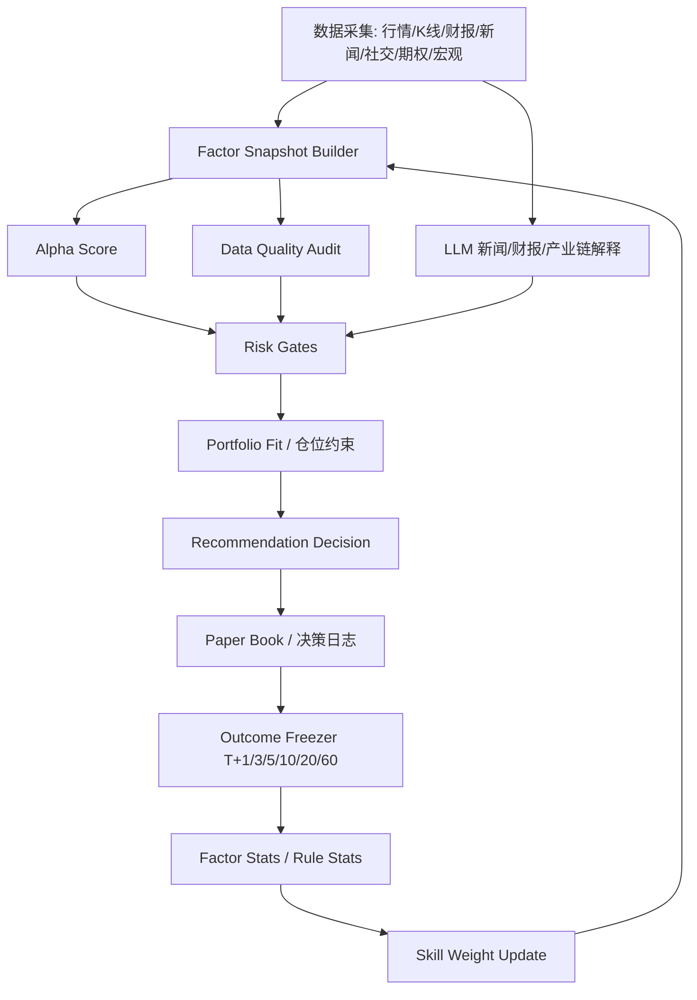

# 股票推荐系统迭代设计与完整实现过程

> 日期：2026-07-01（修订：同日，补充代码库差距与 GitHub 对标）  
> 适用项目：Market Pulse AI  
> 目标：把当前“候选池选股 Agent + 投资建议 Agent”升级为可解释、可追责、可学习的股票推荐系统。  
> 衔接文档：[`IMPROVEMENT_PLAN_V3.md`](IMPROVEMENT_PLAN_V3.md)（竞品路线）、[`IMPROVEMENT_EXECUTION_REPORT.md`](IMPROVEMENT_EXECUTION_REPORT.md)（已落地项）。  
> 重要声明：本文用于系统设计和研究流程，不构成个性化投资建议。

---

## 1. 设计结论

股票推荐系统不应让 LLM 直接决定“买入/卖出”。正确结构是：

```text
结构化因子打分
  + 风险门控
  + 组合约束
  + LLM 负责新闻/财报/产业链解释
  + 历史回测和纸面交易追责
  + 小步调权学习
```

现有项目已经有较好的基础：

- `server.mjs` 已有 `buildAllStockAgentEvaluation`、`runAllStockAgentForRun`、`runAllStockAgentBacktest`、`buildAllStockAgentOutcomeSnapshots`。
- `strategies/all_stock_agent_skill.md` 已经是规则配置源。
- `public/app.js` 已有操作建议页、规则回测展示、纸面组合复盘。

下一步重点不是再加一个“更会说话的 Agent”，而是补齐：

1. 因子快照标准化。
2. 买卖成功判定标准。
3. 学习闭环。
4. 回测和线上追责统一口径。
5. 组合层风险控制。

---

## 1.1 代码库现状盘点（2026-07-01）

> 方法：通读 `server.mjs`、`lib/market_core.mjs`、`strategies/all_stock_agent_skill.md`、`public/app.js`，对照 [`IMPROVEMENT_PLAN_V3.md`](IMPROVEMENT_PLAN_V3.md) 与 [`IMPROVEMENT_EXECUTION_REPORT.md`](IMPROVEMENT_EXECUTION_REPORT.md)。

### 已具备（可直接复用，不必推倒重来）

| 能力 | 代码位置 / 产物 | 与设计文档关系 |
|---|---|---|
| 规则评分 Agent | `buildAllStockAgentEvaluation`（`server.mjs`）+ `all_stock_agent_skill.md` | ⚠️ **规则加权**，不是 §4 的 factor snapshot + alphaScore |
| 每日选股闭环 | `runAllStockAgentForRun`：正式买入 10 + 观察买入 + 卖出信号 | ✅ 候选池、watch-buy 与 paperBook 已分离 |
| 追责冻结 | `buildAllStockAgentOutcomeSnapshots`：T+1/3/5/10、SPY/QQQ 超额、无 look-ahead | ✅ 对应 §6 雏形；缺 MAE/MFE、分行业 benchmark basket |
| 规则统计 + 纸面组合 | `buildAllStockAgentRuleStats`、`buildAllStockAgentPaperBook` | ✅ 按 horizon 统计；自学习 `minSamples=20` |
| 历史 walk-forward 回测 | `runAllStockAgentBacktest` + `POST /api/all-stock-agent/backtest` + 前端按钮 | ✅ **V3-1 已落地**；缺 factor IC / precision@10 / 权益曲线 |
| 预期差规则 | skill `expectation_gap_positive` + `buildReverseDcfExpectationGap` | ⚠️ 已入**规则**，未入**标准化因子快照** |
| 多智能体影子门控 | `allStockAgentDebateGate` → `shadow_cap_buy` / `shadow_downweight` | ⚠️ **V3-2 部分完成**（影子降权，非硬 veto） |
| 宏观 regime | `lib/market_core.mjs` → `scoreFredMacroRegime`；skill `market_risk_ok` | ✅ 对应 §3.1 macroRegime；未乘入 actionScore |
| NYSE 交易日历 | `lib/market_core.mjs` → `addNyseTradingDays` | ✅ T+N 追责已用真实交易日 |
| 数据基础 | Longbridge quote/kline/research、新闻正文、期权链、Form 4、FRED、社交 | ✅ 采集面宽；缺统一 `dataQualityAudit` 总线 |
| 存储演进 | run 分片 + SQLite 镜像（`scripts/sqlite_store_sync.py`） | ⚠️ 镜像同步，**非** `recommendation_decisions` 主读写 |

### 核心缺口（本文档 §4–§8 尚未实现）

| 缺口 | 说明 | 优先级 |
|---|---|---|
| `buildFactorSnapshot` | 无 `factor-snapshot-v1`；评分仍走离散 rule hit | **P0** |
| 行业/市值分组标准化 | `normalizeFactorValue(factorId, raw, peerGroup)` 已接入 factorSnapshot；当前是因子/行业/市值/流动性 baseline 标准化，非完整横截面 median/MAD | **P0 已接线，待升级** |
| `scoreRecommendationFromFactors` | 无 alphaScore × dataQuality × regime 连续公式 | **P0** |
| `recommendation-decision-v1` | decision 缺 `factorSnapshotId`、`benchmarkBasket`、`primaryHorizon`、`invalidations` | **P0** |
| 分类型 benchmark basket | outcome/backtest 仍优先单一 SPY/QQQ，非 §6.1 组合基准 | **P0** |
| MAE / MFE / thesis invalidation | outcome 只有 entry/exit 点，无持有路径指标 | **P1** |
| factor IC / precision@10 | 回测只有 `ruleStats`，无因子层学习指标 | **P0** |
| 因子权重学习闭环 | 现有自学习只调 **rule weight**，不调 §3.1 因子权重 | **P1** |
| `dataQualityAudit` 总线 | 投资建议有局部 audit；Agent decision 未强制带全量来源审计 | **P1** |
| 新闻故事线 → newsCatalyst | 新闻分散展示，未聚合为可评分故事线 | **P1** |
| 组合层 `portfolioFitScore` | 单票 `positionSizing` 有；缺行业集中度/相关性约束 | **P1** |
| 前端因子瀑布图 / 学习日志页 | 操作建议仍展示 rule 命中，非因子贡献 | **P1** |
| Agentic 工具调用聊天 | `/api/chat` 仍为静态上下文 | **P2**（V3-5） |
| 内部人/13F/IV crush 因子 | research pack 有摘要，未标准化入因子 | **P2**（V3-8、V3-4） |
| survivorship-free 回测 | 回测 caveats 已声明限制；缺退市票/历史一致预期 | **P3**（V3-10） |

### 结论

基础设施**领先多数 GitHub 玩具项目**（数据源、追责、纸面组合、walk-forward 回测已有）。真正阻塞“AI 股票推荐”从规则引擎升级为**因子推荐系统**的，是 **§4 factor snapshot + §5 连续评分 + §6 统一 outcome 口径 + §7 因子层学习指标** 四块尚未接线。

---

## 2. 调研依据

公开研究和机构框架支持以下方向：

- MSCI/BlackRock 的 factor investing 框架长期使用价值、质量、动量、规模、低波动等风格因子。
- Fama-French 5 因子覆盖市场、规模、价值、盈利能力和投资风格，是股票收益解释的经典基础。
- AQR 对动量和因子动量有长期研究，动量适合作为股票筛选的重要因子。
- RavenPack 等新闻数据供应商把新闻情绪、新闻数量、情绪变化做成可量化信号。
- 分析师预测修正、EPS/收入一致预期变化、short interest、内部人交易都可以作为补充信号。
- 回测必须使用 walk-forward、out-of-sample、交易成本、benchmark 超额收益，避免 look-ahead bias 和 survivorship bias。

参考来源：

- MSCI Factor Indexes: https://www.msci.com/indexes/category/factor-indexes
- Kenneth French Fama/French 5 Factors: https://mba.tuck.dartmouth.edu/pages/faculty/Ken.french/Data_Library/f-f_5_factors_2x3.html
- AQR Factor Momentum Everywhere: https://www.aqr.com/Insights/Research/Working-Paper/Factor-Momentum-Everywhere
- AQR Momentum Indices: https://www.aqr.com/Insights/Datasets/Momentum-Indices-Monthly
- RavenPack Constructing a Sentiment Factor: https://www.ravenpack.com/research/constructing-sentiment-factor
- RavenPack Attention and News Sentiment: https://www.ravenpack.com/research/stock-market-reaction-to-news-sentiment/
- Walk-forward/backtest validation: https://mbrenndoerfer.com/writing/backtesting-trading-strategies-simulation-frameworks
- Walk-forward validation paper: https://arxiv.org/html/2512.12924v1

### 2.1 GitHub 开源项目对标（2026-07-01）

| 项目 | Stars 量级 | 我们有、它弱 | 它有、我们弱 | 可借鉴项 |
|---|---|---|---|---|
| [TradingAgents](https://github.com/TauricResearch/TradingAgents) | ~90k | 多源数据、FRED、纸面追责 | 真多轮 LLM 辩论 + 风险经理**硬审批** | 把 `riskVeto` 从 shadow 升级为可配置 hard veto；LangGraph 式可观测 pipeline |
| [Vibe-Trading](https://github.com/HKUDS/Vibe-Trading) | ~15k | 新闻/期权/宏观采集、中文 UI | **452 预置 alpha 因子** + 一切走 MCP 工具调用 | 因子库配置化；chat 按需调 `research-pack`/`screener`（→ V3-5） |
| [ai-hedge-fund](https://github.com/virattt/ai-hedge-fund) | ~61k | 多 persona 评分镜、反向 DCF | **组合经理角色** + 内置 backtester CLI | 组合层加减仓 Agent；按 agent/ticker 分维度回测报告 |
| [FinRobot](https://github.com/AI4Finance-Foundation/FinRobot) | ~7k | 本地数据链更完整 | Financial CoT + 多模态研报生成 | LLM 只负责解释层，不碰最终买卖分（与 §1 一致）；支持多模态（图表+文字）复盘报告 |
| [AgenticTrading](https://github.com/Open-Finance-Lab/AgenticTrading) | 研究级 | 已有 outcome 冻结 | **SQLite 决策日志** + dashboard 对比 baseline | `recommendation_decisions` 表 + `/api/recommender/backtest` 对标其 runs DB |
| [FinCON](https://github.com/lindd-zju/FinCON) / [The-FinAI/FinCon](https://github.com/The-FinAI/FinCon) | 论文级 | 规则/outcome 追责 | **Conceptual Verbal Reinforcement**：跨 episode 更新投资信念 | §6 学习闭环：用 factor stat + changelog 替代纯 LLM 信念更新，或引入长期记忆库（Persistent Memory） |
| [BenPomme/agentictrading](https://github.com/BenPomme/agentictrading) | 工厂级 | 纸面 book | **lineage-scoped** 纸面账户 + walkforward→shadow→paper 晋升门 | 调权前必须过回测门槛；weak lineage 自动退役 |
| [AutoHedge](https://github.com/The-Swarm-Corporation/AutoHedge) | 潜力级 | 因子快照更落地 | **群体智能 (Swarm Intelligence)** 与四大专属 Agent（Director, Quant, Risk Manager, Execution） | 补充**执行代理 (Execution Agent)** 模拟滑点与 VWAP；引入 Portfolio 层面的 Agent 负责仓位重平衡与归因分析 |
| [Look-Ahead-Bench](https://arxiv.org/pdf/2601.13770) | 基准 | `runAllStockAgentBacktest` 已声明 PIT 限制 | 形式化 look-ahead 验收集 | 回测 CI：`scripts/core_regression_tests.mjs` 扩展 look-ahead cases |

**对标结论**：Market Pulse AI 在**数据采集 breadth** 和**前向 track record** 上不输头部项目；差距集中在 **(1) 因子标准化层**、**(2) 组合/风险硬门控 (Portfolio-level Agent)**、**(3) 多智能体群体辩论复盘 (Swarm Debate Review)**、**(4) 机构级回测完整度与长期记忆**。本文档 §9 阶段 1–6 正好覆盖 (1)(2)；后续阶段需重度投入平台化复盘 (3)。

---

## 3. 推荐系统 v1 因子体系

### 3.1 初始因子权重

第一版权重应保守、可解释，不应一开始用机器学习自动学习权重。建议先按下表运行 2-4 周纸面交易和历史回放，再根据 outcome 调整。

| 因子 | 初始权重 | 作用 | 当前系统接入状态 |
|---|---:|---|---|
| 价格趋势/动量 | 18% | 判断股票是否处在可交易趋势中 | ✅ 数据有；⚠️ 经 rule `trend_confirmed`/`momentum_not_overheated`，**非** snapshot score |
| 基本面质量/成长 | 16% | 判断公司是否有收入、利润、现金流支撑 | ✅ 数据有；⚠️ rule `fundamental_quality`，未分组标准化 |
| 估值/预期差 | 14% | 判断当前价格是否已经透支增长 | ✅ 反向 DCF + research；⚠️ rule `expectation_gap_*`，缺 snapshot |
| 财报/分析师修正 | 14% | 判断 EPS/收入预期是否上修或下修 | ⚠️ `collectLongBridgeResearchPack` 有 consensus；**未**单独因子块 |
| 新闻催化强度 | 12% | 判断新闻是否真正影响收入、订单、指引、监管 | ⚠️ rule `material_positive_news`；**缺**故事线聚合（V3-3C） |
| 行业/同业/上下游 | 8% | 判断个股是否受行业 beta 或供应链影响 | ⚠️ `industryChainPack` + rule `industry_chain_supported` |
| 大盘/宏观 regime | 6% | 控制仓位和买入门槛 | ✅ FRED regime + rule `market_risk_ok`；**未**乘入 actionScore |
| 期权/盘口/资金流 | 5% | 辅助识别短期资金异动 | ⚠️ 期权链/盘口有；**无** IV crush 因子（V3-4） |
| 内部人/机构/空头 | 4% | 捕捉聪明钱、卖空压力和机构变化 | ⚠️ research pack 摘要；**未**入 skill 因子（V3-8） |
| 社交热度 | 3% | 发现早期线索，不单独驱动买入 | ⚠️ rule `social_with_catalyst`；已有“不能只靠热度”门控 |

合计：100%。

### 3.2 风险门控不计入 100 分

风险门控单独处理，优先级高于总分。

硬 veto：

- 缺价格。
- 缺 K 线且无法确认趋势。
- 数据质量低于 live 门槛。
- 流动性过低。
- 重大负面新闻强于正面催化。
- 公司主业/行业无法识别。
- 明确财务造假、退市、停牌、重大监管风险。

cap buy：

- 大盘高风险。
- 财报临近但没有财报计划。
- 期权 IV 极高，存在 IV crush 风险。
- 多智能体风险经理否决。
- 多空分歧大，但没有被证伪。

---

## 4. 因子计算标准

### 4.1 统一因子快照

每天每只股票生成一份 `factor_snapshot`。

```json
{
  "schemaVersion": "factor-snapshot-v1",
  "ticker": "NVDA",
  "asOf": "2026-07-01T13:30:00Z",
  "universe": "us_equity",
  "factors": {
    "momentum": {
      "raw": {
        "return20d": 8.2,
        "priceVsSma20Pct": 4.1,
        "rsi14": 63.5,
        "volumeRatio20d": 1.4
      },
      "score": 78,
      "quality": 92,
      "source": ["Longbridge Kline", "AkShare stock_us_hist"],
      "missingReason": ""
    },
    "expectationGap": {
      "raw": {
        "targetUpsidePct": 12.5,
        "impliedGrowthPct": 18.1,
        "referenceGrowthPct": 22.3,
        "epsRevision30dPct": 3.2
      },
      "score": 70,
      "quality": 75,
      "source": ["Longbridge Research Pack"],
      "missingReason": ""
    }
  },
  "dataQualityScore": 84
}
```

### 4.2 标准化方法

不要直接比较原始值。必须按行业、市值、流动性分组做标准化：

```text
factor_z = (raw_value - group_median) / group_mad
factor_score = clamp(50 + 12 * factor_z, 0, 100)
```

分组建议：

- 行业：GICS/Longbridge industry/eastmoney industry。
- 市值：mega/large/mid/small。
- 流动性：美元成交额分层。

原因：半导体高估值和银行高估值不能直接比较；小盘股和 mega-cap 的成交量变化也不能直接比较。

---

## 5. 推荐评分公式

### 5.1 Alpha 分

```text
alphaScore =
  0.18 * momentum
  + 0.16 * qualityGrowth
  + 0.14 * valuationExpectation
  + 0.14 * earningsRevision
  + 0.12 * newsCatalyst
  + 0.08 * industryChain
  + 0.06 * macroRegime
  + 0.05 * optionsFlow
  + 0.04 * smartMoney
  + 0.03 * socialAttention
```

### 5.2 数据质量乘数

```text
dataQualityMultiplier =
  dataQuality >= 85 ? 1.00 :
  dataQuality >= 70 ? 0.92 :
  dataQuality >= 55 ? 0.78 :
  0.55
```

### 5.3 宏观环境乘数

```text
regimeMultiplier =
  riskScore < 45 ? 1.05 :
  riskScore < 65 ? 1.00 :
  riskScore < 80 ? 0.85 :
  0.65
```

### 5.4 最终决策分

```text
actionScore =
  alphaScore
  * dataQualityMultiplier
  * regimeMultiplier
  + portfolioFitScore
  - riskPenalty
```

建议动作：

| 条件 | 动作 |
---|---|
| `hardVeto = true` | 不买/回避 |
| `actionScore >= 76` 且无 cap | 买入候选 |
| `actionScore >= 66` 且有 cap | 观察买入 |
| `actionScore 55-66` | 等待触发 |
| `actionScore 40-55` | 持有/中性 |
| `actionScore < 40` | 回避或卖出检查 |

---

## 6. 买入/卖出成功判定

### 6.1 不能用裸收益判断

买入成功不是“股票涨了”这么简单。必须看相对收益：

```text
excessReturn =
  stockReturn
  - benchmarkReturn
  - estimatedCost
```

benchmark 建议：

| 股票类型 | benchmark |
|---|---|
| 默认美股 | 50% SPY + 30% sector ETF + 20% QQQ |
| AI/半导体 | 40% QQQ + 40% SMH + 20% SPY |
| 小盘成长 | 50% IWM + 30% sector ETF + 20% SPY |
| 防御/医药 | 50% SPY + 30% sector ETF + 20% low-vol ETF |

### 6.2 买入成功标准

每个买入建议记录主 horizon：短线 T+10，中线 T+20，事件驱动 T+5/T+10，财报驱动 T+1/T+5/T+20。

成功：

```text
mainHorizonExcessReturn >= +2%
且没有提前触发 thesis invalidation
```

失败：

```text
mainHorizonExcessReturn <= -2%
或先触发止损/财报证伪/新闻证伪
```

中性：

```text
-2% < mainHorizonExcessReturn < +2%
```

额外过程指标：

- `MAE`: maximum adverse excursion，持有期间最大不利波动。
- `MFE`: maximum favorable excursion，持有期间最大有利波动。
- `timeToProfit`: 多久开始跑赢 benchmark。
- `thesisHit`: 原 thesis 是否被事实验证。
- `stopTriggered`: 是否先触发止损。

### 6.3 卖出成功标准

成功：

```text
卖出后 main horizon 内股票跑输 benchmark >= 2%
或卖出避免了后续明显回撤
```

失败：

```text
卖出后股票跑赢 benchmark >= 2%
且原卖出理由没有被证实
```

中性：

```text
卖出后相对表现没有明显差异
```

止盈卖出单独记录：

- 是否保住利润。
- 是否错过后续趋势。
- 是否符合原交易计划。

### 6.4 智能复盘引擎 (AI Post-Trade Review Platform)

“复盘”不能仅仅停留在单票收益数字的统计，一个完整的**平台级复盘与投资建议系统**（参考 AutoHedge 与 TradingAgents 的 Swarm 设计）需要实现：

1. **群体辩论式归因 (Swarm Debate Attribution)**
   - 引入 `Bull Analyst`、`Bear Analyst` 和 `Risk Manager` 多 Agent 角色。
   - 当一笔交易触及结束条件（止盈/止损/到期）时，由多 Agent 共同提取因子表现、市场大环境、突发新闻，并辩论“失败/成功是由运气（Beta/宏观）还是能力（Alpha/个股判断）导致”。
2. **组合级表现归因 (Portfolio-Level Review)**
   - 不仅做单票复盘，还要对整体 `Paper Book` 的风格暴露（Value vs Growth）、行业集中度、波动率进行诊断，给出“削减半导体暴露，增加防御性资产”等平台级投资建议。
3. **长期记忆与认知迭代 (Persistent Memory / Belief Update)**
   - 提取复盘教训并向量化存入长时记忆库（如：“在降息初期，不要单纯因为高息股的短期利好而过早买入”）。下次做推荐时，作为 `Knowledge Context` 注入。
4. **多模态可交互报告 (Interactive Multi-modal Report)**
   - 结合 FinRobot 的思路，把买卖点标记在 K 线图上，将盈亏曲线可视化，并允许用户通过聊天界面对单笔失败交易进行追问（“为什么我们在 NVDA 财报前没买入？”）。

---

## 7. 学习指标

系统学习不能只看胜率。建议至少统计以下指标：

| 指标 | 说明 | 用途 |
|---|---|---|
| `precision@10` | 每天推荐前 10 只成功比例 | 判断推荐列表质量 |
| `avgExcessReturn` | 平均超额收益 | 判断总体 alpha |
| `hitRate` | 成功率 | 判断方向正确率 |
| `payoffRatio` | 平均盈利 / 平均亏损 | 判断盈亏比 |
| `maxDrawdown` | 最大回撤 | 判断风险 |
| `rankIC` | 因子排序与未来收益相关性 | 判断因子有效性 |
| `turnover` | 换手率 | 控制过度交易 |
| `regimeSplit` | 不同大盘环境下表现 | 判断何时失效 |
| `coverageAdjustedReturn` | 数据质量加权收益 | 避免低质量样本污染 |

---

## 8. 数据结构设计

### 8.1 推荐决策记录

```json
{
  "schemaVersion": "recommendation-decision-v1",
  "decisionId": "rec-buy-20260701-NVDA",
  "ticker": "NVDA",
  "action": "buy",
  "generatedAt": "2026-07-01T13:30:00Z",
  "price": 150.2,
  "actionScore": 78,
  "alphaScore": 81,
  "riskPenalty": 4,
  "portfolioFitScore": 1,
  "dataQualityScore": 86,
  "regime": "risk-on",
  "benchmarkBasket": [
    { "ticker": "QQQ", "weight": 0.4 },
    { "ticker": "SMH", "weight": 0.4 },
    { "ticker": "SPY", "weight": 0.2 }
  ],
  "matchedFactors": [
    "momentum_positive",
    "eps_revision_positive",
    "news_catalyst_material"
  ],
  "riskGates": [],
  "thesis": "AI 服务器需求和 EPS 上修共同支撑，价格站上 20 日线。",
  "invalidations": [
    "跌破 20 日线且成交量放大",
    "下一份财报指引低于一致预期",
    "主要客户订单被证伪"
  ],
  "horizons": [1, 3, 5, 10, 20, 60],
  "primaryHorizon": 20,
  "modelVersion": "skill-2026-07-01"
}
```

### 8.2 Outcome 记录

```json
{
  "schemaVersion": "recommendation-outcome-v1",
  "decisionId": "rec-buy-20260701-NVDA",
  "ticker": "NVDA",
  "horizonDays": 20,
  "entryPrice": 150.2,
  "exitPrice": 160.0,
  "stockReturnPct": 6.52,
  "benchmarkReturnPct": 2.10,
  "estimatedCostPct": 0.15,
  "excessReturnPct": 4.27,
  "outcome": "success",
  "maePct": -2.8,
  "mfePct": 8.1,
  "thesisHit": true,
  "stopTriggered": false,
  "freezeAt": "2026-07-29T20:00:00Z"
}
```

### 8.3 因子统计记录

```json
{
  "schemaVersion": "factor-stat-v1",
  "factorId": "momentum",
  "modelVersion": "skill-2026-07-01",
  "horizonDays": 20,
  "samples": 86,
  "hitRate": 0.57,
  "avgExcessReturnPct": 1.8,
  "rankIC": 0.06,
  "tStat": 2.1,
  "lastUpdatedAt": "2026-07-31T20:00:00Z"
}
```

---

## 9. 完整实现过程

### 阶段 0：现状对齐 ✅ 已完成（2026-07-01）

目标：不推倒重来，接到现有结构上。

检查点（均已存在）：

- `server.mjs`：`buildAllStockAgentEvaluation`、`runAllStockAgentForRun`、`runAllStockAgentBacktest`、`buildAllStockAgentOutcomeSnapshots`、`buildAllStockAgentRuleStats`、`buildAllStockAgentPaperBook`
- `strategies/all_stock_agent_skill.md`：含 `expectation_gap_*`、自学习 changelog
- `public/app.js`：操作建议页、规则回测按钮、纸面组合/追责仪表盘
- `lib/market_core.mjs`：NYSE 日历、FRED regime、新闻主体归属、期权 FIFO

产出：

- 本文档 + §1.1 差距表。
- 数据源覆盖：见 [`IMPROVEMENT_PLAN_V3.md`](IMPROVEMENT_PLAN_V3.md) §〇 现状盘点表。

**阶段 0 之外已提前落地的项**（原计划在后续阶段）：

- V3-1 历史 walk-forward 回测 → `runAllStockAgentBacktest`
- V3-2 影子 debate 门控 → `allStockAgentDebateGate`（shadow only）
- §8 追责闭环 → outcomeSnapshots + paperBook + minSamples=20

### 阶段 1：实现 factor snapshot builder

新增函数：

```text
buildFactorSnapshot(run, ticker, context)
normalizeFactorValue(factorId, rawValue, peerGroup)
buildFactorSnapshotForRun(run)
```

建议位置：

- `server.mjs` 中 all-stock-agent 相关函数附近。
- 后续可拆到 `lib/recommender/factors.mjs`。

输入：

- quote
- technical
- fundamental
- researchPack
- allNewsPack
- industryChainPack
- options
- microstructure
- socialHot
- marketOverview

输出：

- `factorSnapshots: []`
- 每个因子带 `raw/score/quality/source/missingReason`。

验收：

- 任意候选股票都能解释每个因子的分数来自哪里。
- 缺失数据不再变成“暂缺”，而是明确 `missingReason`。

### 阶段 2：改造 scoring engine

新增函数：

```text
scoreRecommendationFromFactors(factorSnapshot, skill, portfolioContext)
applyRiskGates(scoredCandidate, context)
buildBenchmarkBasket(ticker, profile, industry)
```

现有 `buildAllStockAgentEvaluation` 改造方向：

1. 先读 factor snapshot。
2. 计算 `alphaScore`。
3. 应用 `dataQualityMultiplier`。
4. 应用 `regimeMultiplier`。
5. 加 `portfolioFitScore`。
6. 扣 `riskPenalty`。
7. 输出 `actionScore` 和可解释明细。

验收：

- 买入候选不再只是规则列表，而是显示每个因子的贡献。
- 风险门控能说明是 hard veto 还是 cap buy。

### 阶段 3：记录完整 decision log

扩展现有 decision：

- `alphaScore`
- `actionScore`
- `factorSnapshotId`
- `benchmarkBasket`
- `primaryHorizon`
- `invalidations`
- `modelVersion`
- `portfolioContext`

写入位置：

- `db.allStockAgent.decisions`
- 后续迁到 SQLite 表 `recommendation_decisions`。

验收：

- 任意历史建议都能复原当时为什么推荐。
- 后续 outcome 不会因为当前数据变化而污染历史判断。

### 阶段 4：统一 outcome freezer

现有 `buildAllStockAgentOutcomeSnapshots` 保留，但增强：

1. 支持 benchmark basket，不只 SPY/QQQ。
2. 支持 buy/sell 不同成功标准。
3. 记录 MAE/MFE。
4. 记录 thesis invalidation。
5. 冻结后不可修改，只追加修正记录。

新增函数：

```text
buildBenchmarkReturn(db, benchmarkBasket, entryAt, exitAt)
classifyBuyOutcome(decision, pricePath, benchmarkPath)
classifySellOutcome(decision, pricePath, benchmarkPath)
```

验收：

- 买入/卖出 outcome 都有统一口径。
- 可以解释“为什么这次算成功/失败/中性”。

### 阶段 5：扩展规则回测

现有 `/api/all-stock-agent/backtest` 已有雏形。

增强目标：

- 每个历史快照生成 factor snapshot。
- 按当时可得数据评分。
- 用后续快照冻结 outcome。
- 输出：
  - factor IC
  - precision@10
  - avg excess return
  - max drawdown
  - turnover
  - regime split

接口：

```http
POST /api/recommender/backtest
```

请求：

```json
{
  "from": "2026-06-01",
  "to": "2026-07-01",
  "universe": "all-stock-agent",
  "horizons": [1, 3, 5, 10, 20],
  "modelVersion": "current"
}
```

验收：

- 前端能看到因子表现，不只是规则表现。
- 如果某个因子过去 30 天明显反向，系统能提示降权，而不是自动乱改。

### 阶段 6：学习和调权

学习原则：

- 不用单日结果调权。
- 每个因子至少 30-50 个有效样本。
- 单次权重调整不超过 1-2 个百分点。
- 新因子先 shadow mode。
- 连续 3 个周期有效才升权。
- 连续 3 个周期反向才降权。

调权公式建议：

```text
factorEdge =
  0.45 * normalizedAvgExcessReturn
  + 0.25 * normalizedRankIC
  + 0.20 * normalizedHitRate
  - 0.10 * normalizedDrawdownPenalty

weightDelta =
  clamp(factorEdge * 2, -2, +2)
```

写入：

- `strategies/all_stock_agent_skill.md`
- 同时保存 changelog。

验收：

- 每次 skill 更新都有原因、样本数、旧权重、新权重。
- 可以回滚到上一个 skill 版本。

### 阶段 7：前端改造

新增页面或区块：

1. 操作建议页：推荐原因从“规则命中”升级为“因子贡献瀑布图”。
2. 规则回测页：增加因子表现表。
3. 单股详情页：增加 factor snapshot 面板。
4. 学习日志页：展示本周哪些因子被升权/降权。
5. 数据质量页：展示哪些数据源拖累推荐质量。

展示原则：

- 首页不堆所有细节。
- 每个推荐只展示最重要 3 个正向因素、3 个风险因素。
- “社交热度”不能单独作为买入理由。
- “新闻催化”必须有正文摘要和影响链路。

### 阶段 8：自动化和监控

定时任务：

| 时间 | 任务 |
|---|---|
| 每天盘前 | 更新行情、新闻、宏观、财报日历，生成推荐候选 |
| 每天盘后 | 冻结 outcome，更新 paper book，生成学习报告 |
| 每周末 | 跑扩展回测，评估因子权重 |
| 每月 | 输出模型版本报告，检查过拟合和数据源质量 |

告警：

- 数据源连续失败。
- 某因子缺失率超过 40%。
- 推荐列表 3 天连续跑输 benchmark。
- 纸面组合最大回撤超过阈值。
- skill 自动调权失败。

---

## 10. 最小可执行任务清单（含完成状态，2026-07-01）

图例：✅ 已完成 · 🟡 部分完成 · ⬜ 未开始

### P0 —— 因子推荐核心（阻塞“升级”的关键路径）

| 状态 | 任务 | 说明 / 依赖 |
|:---:|---|---|
| ✅ | 新增 `buildFactorSnapshot` / `buildFactorSnapshotForRun` | 2026-07-01 已接入 `server.mjs`；暂未拆到 `lib/recommender/factors.mjs` |
| 🟡 | 新增 `normalizeFactorValue(factorId, raw, peerGroup)` | 2026-07-01 已接入 `buildFactorSnapshot`：每个因子保留 `heuristicScore`，再生成标准化 `score/normalization`；仍待升级为真实横截面 median/MAD |
| ✅ | 新增 `scoreRecommendationFromFactors` + `applyRiskGates` | 2026-07-01 已做 shadow 模式，与 ruleScore 并列展示/记录 |
| ✅ | decision 升级 `recommendation-decision-v1` | 已加入 `factorSnapshot`、`benchmarkBasket`、`primaryHorizon`、`invalidations`、`modelVersion` |
| ✅ | `buildBenchmarkBasket(ticker, profile, industry)` | 已按行业/市值生成 SPY/QQQ/行业 ETF basket，并支持缺失 fallback |
| 🟡 | outcome 支持 benchmark basket + 买卖分型判定 | 已支持 benchmark basket；买/卖分型判定沿用现有 win/loss 口径，MAE/MFE 待 P1 |
| ✅ | 回测输出 learning 指标 | 已输出 factor IC、precision@10、maxDrawdown、turnover、factorStats |
| 🟡 | 历史 walk-forward 回测 | ✅ `runAllStockAgentBacktest` + API + UI；⬜ PIT 验收集、权益曲线、regime split |
| 🟡 | debate/risk 门控接入决策 | ✅ shadow cap；⬜ 样本足够后升级 configurable `veto_buy`（V3-2 第二阶段） |

### P1 —— 组合级控制、复盘平台与可解释性

| 状态 | 任务 | V3 映射 / 扩展 |
|:---:|---|---|
| 🟡 | **智能群体复盘引擎 (Swarm Debate Review)** | 已做规则化 Bull/Bear/Risk Manager 复盘；尚未接入真实多轮 LLM 辩论 |
| 🟡 | **长期记忆库与投资信念更新 (Persistent Memory)** | 已将 outcome 教训写成结构化 memory；尚未接入向量库召回 |
| ✅ | **组合级归因与风险报告 (Portfolio Attribution)** | 已在 paperBook 输出行业/主题暴露、已实现/未实现归因和集中度提示 |
| ✅ | 前端操作建议：因子贡献瀑布图（Top3 正向 + Top3 风险） | 2026-07-01 已在操作建议卡展示因子贡献条、新闻故事线和数据缺口 |
| ✅ | 单股详情：factor snapshot 面板 | V3-3：从最新 Agent evaluation/decision 复用 factorSnapshot 展示 |
| 🟡 | 预期差/分析师修正独立因子块 | V3-3：rule 已有，panel 部分有 |
| ✅ | `dataQualityAudit` 总线（每条 decision 强制携带） | V3-3B：decision/watch/hold/backtest decision 均携带数据块质量、来源和缺失原因 |
| ✅ | 新闻故事线 → `newsCatalyst` 因子 | V3-3C：按财报/订单/AI/监管/评级/供应链/宏观/社交聚合 storylines，再计入 newsCatalyst |
| ✅ | 组合层 `portfolioFitScore` / 仓位上限文案 | V3-3D：基于真实持仓、Agent 虚拟持仓、行业集中度、单票权重和流动性扣分 |
| ✅ | outcome 增加 MAE/MFE、`thesisHit`、`stopTriggered` | §6.2：线上 outcome 与 backtest outcome 已统一写入过程指标 |
| 🟡 | 学习日志 / skill changelog | rule 调权 changelog 有；因子学习日志已输出 watch_promote/watch_demote，尚未自动改因子权重 |
| ✅ | `POST /api/recommender/backtest`（因子版，区别于现有 all-stock-agent backtest） | §9 阶段 5：已作为标准推荐系统回测别名，返回 learningLog/factorStats/outcomes |
| 🟡 | SQLite 表 `recommendation_decisions` / `factor_stats` | 已新增 `recommendation_decisions`、`recommendation_outcomes`、`factor_stats` 镜像表；主读写仍未迁 |

### P2 —— 差异化与运营

| 状态 | 任务 | V3 映射 |
|:---:|---|---|
| 🟡 | 组合层 vol-target / 集中度热力图 / regime 压力测试 | 已有组合集中度归因；vol-target/压力测试未做 |
| 🟡 | 内部人/13F/空头 → `smartMoney` 因子 + 面板 | `smartMoney` 已入 factorSnapshot，研报代理已展示内部人/空头/机构摘要；13F 深度变化未做 |
| 🟡 | 财报催化指挥台 + 期权 IV crush 门控 | optionsFlow 已对高 IV 降分，财报临近 rule 已有；独立指挥台未做 |
| ⬜ | 实时盘中告警引擎 | V3-6 |
| ⬜ | Agentic 工具调用 `/api/chat` | V3-5 |
| ⬜ | Longbridge screener 因子筛选器 | V3-9 |
| 🟡 | regime split 回测 + 自动周报 | 回测已输出 regimeSplit；自动周报未做 |
| ⬜ | 退市票 + survivorship-free 历史 | V3-10 |
| ⬜ | 多轮真 LLM 辩论（低频标的） | V3-11 |

### 建议实施顺序（2026-07-01 修订）

```text
第一批（2–3 周，闭合 P0）：
  buildFactorSnapshot
  → scoreRecommendationFromFactors（shadow 模式，与 ruleScore 并行）
  → benchmarkBasket + decision schema 升级
  → 回测补 factor IC / precision@10

第二批（P1，提升可解释）：
  前端因子瀑布 + dataQualityAudit
  → 故事线 newsCatalyst
  → MAE/MFE outcome
  → portfolioFitScore

第三批（P2 + 智能复盘平台化）：
  引入 Swarm 多智能体辩论进行单票及组合级复盘
  → 建设 Persistent Memory 反哺新投资
  → 多模态交互式复盘图表
  → debate 硬 veto、组合层、工具 chat、IV crush、screener
```

与 [`IMPROVEMENT_PLAN_V3.md`](IMPROVEMENT_PLAN_V3.md) 关系：**V3-1/V3-2 已部分超前完成**；本文档 P0 的 factor snapshot 层是后续架构的**前置依赖**——没有基础快照与标准化打分，无论后续做“投资建议”还是“智能复盘”，LLM 都会陷入“无据可依”的空洞聊天。升级为完整平台，重心必须从“如何提取数据”转向“如何管理知识闭环（复盘-记忆-运用）”。

### 2026-07-01 P0 实现记录

- `server.mjs` 新增 `RECOMMENDER_FACTOR_WEIGHTS`、`buildFactorSnapshot`、`buildFactorSnapshotForRun`、`normalizeFactorValue`、`scoreRecommendationFromFactors`。
- 因子快照当前覆盖 10 类因子：momentum、qualityGrowth、valuationExpectation、earningsRevision、newsCatalyst、industryChain、macroRegime、optionsFlow、smartMoney、socialAttention。
- `buildAllStockAgentEvaluation` 已生成 shadow `alphaScore/actionScore/dataQualityScore`，正式 buy/sell 决策仍由原 ruleScore 控制，降低行为突变风险。
- `allStockAgentDecisionFromEvaluation` 已升级到 `recommendation-decision-v1`，同时保留 `legacySchemaVersion`。
- 新增 `buildBenchmarkBasket` 和 basket benchmark return，outcome/backtest 不再只能使用单一 SPY/QQQ。
- `/api/all-stock-agent/backtest` 已输出 `learningMetrics` 和 `factorStats`，包含 `precisionAt10/actionScoreRankIC/alphaScoreRankIC/maxDrawdownPct/turnover`。
- `public/app.js` 操作建议卡片展示 Alpha、Action、数据质量；规则回测块展示因子表现与 RankIC。
- 验证：`node --check server.mjs`、`node --check public/app.js` 通过；60 天/24 快照回测返回 22 个信号、69 个到期 outcome、factorStats 正常。
- 2026-07-01 修复补充：`normalizeFactorValue` 已不再是死代码，factorSnapshot 每个因子都写入 `heuristicScore` 与 `normalization`；相关纯函数已抽到 `lib/recommender_core.mjs` 并接入 `scripts/core_regression_tests.mjs`。

### 2026-07-01 P1 实现记录

- `server.mjs` 新增 `buildDataQualityAudit`，每条正式买入、观察买入、持仓观察和回测 decision 都携带因子数据质量、来源、状态和缺失原因。
- `server.mjs` 新增新闻故事线聚合：`buildNewsStorylines` 会按财报/指引、客户/订单、AI/数据中心、监管/法律、分析师/目标价、产品/供应链、宏观/行业和社交热度分类，并反哺 `newsCatalyst` 因子。
- `server.mjs` 新增 `buildPortfolioFitScore`，把已有持仓、单票权重、同板块集中度和流动性纳入 `actionScore`。
- `buildAllStockAgentOutcomeSnapshots` 与 `runAllStockAgentBacktest` 已写入 `maePct`、`mfePct`、`timeToProfitDays`、`thesisHit`、`stopTriggered`、`pathSamples`。
- 新增 `buildRecommenderLearningLog` 和 `/api/recommender/backtest`，用于输出因子升/降权观察建议，不自动改权重。
- `public/app.js` 操作建议卡增加因子贡献条、新闻故事线和数据缺口；回测卡增加学习日志。
- 验证：`node --check server.mjs`、`node --check public/app.js` 通过；`POST /api/recommender/backtest` 返回 `dataQualityAudit=true`、`portfolioFit=true`、10 类 factor、69 个 outcome 样本和 learningLog。首次手动 `/api/all-stock-agent/run` 在全候选预抓模式下超过 4 分钟后中断客户端请求；后续完整等待已确认可完成，耗时约 2-3 分钟。
- 后续补充：`swarmReview` 已进入 outcome/backtest outcome；`persistentMemory` 已进入 allStockAgent state；`paperBook.portfolioAttribution` 已输出组合暴露；`scripts/sqlite_store_sync.py` 已新增 recommendation/factor 镜像表；单股详情页已加入“推荐因子快照”；回测卡已加入 regime split。
- 最新验证：全量候选池 Agent 运行完成，universe 154、evaluated 154、watchBuy 10、hold 8；`persistentMemory` 19 条，`paperBook.portfolioAttribution=true`。SQLite 同步成功，`recommendation_decisions=69`、`recommendation_outcomes=19`，`factor_stats=0` 是因为当前历史 outcome 多数来自旧 schema，尚无可统计的 factorSnapshot outcome；新 schema outcome 到期后会写入。

---

## 11. 不应该做的事

- 不让 LLM 直接输出最终买卖分。
- 不用只读标题的新闻做推荐。
- 不用单一 SPY 判断所有股票成功失败。
- 不用一天 outcome 自动调权。
- 不把社交热度当作独立买入理由。
- 不在数据质量不足时强行输出“买入”。
- 不把历史回测收益写成收益承诺。

---

## 12. 推荐的最终系统形态



最终目标不是“每天告诉我 10 只股票”，而是：

```text
每天给出少量可解释候选；
每条候选都有数据来源、风险门控、组合限制和可证伪 thesis；
后续自动追责；
只有统计上有效的规则才逐步升权；
无效规则自动降权或进入 shadow mode。
```
